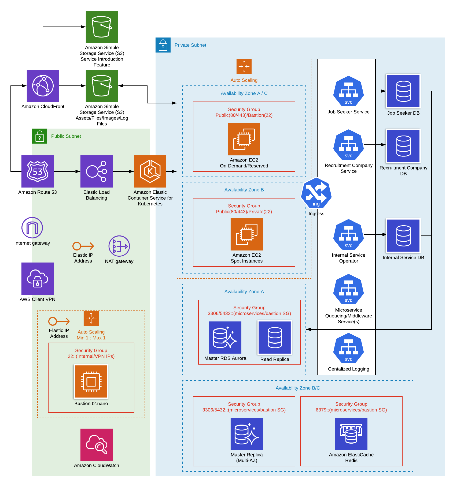

# Microservices Architecture

## Infrastructure Design

## Infrastructure Resources

### Network

* **VPC**
> Development, Stage, and Production Environments will be in different VPCs since they don't need access to each environment's resources and for security purposes. AWS Organizations can be created for both production and non-production environments for additional security upon access and to efficiently monitor billing of resources.

* **Public Subnet**
> Resources placed in public subnet will be limited for security purposes.
Bastion host(jump server), elastic load balancer, and nat gateway will be in public subnet.

* **Private Subnet**
> Development, Stage, and Production EC2 instances, elasticache, and RDS instances will be in the private subnet since these resources do not need direct access and will be accessible only from bastion host.

* **Nat Gateway**
> This resource allows services to have outbound internet access without having the security of these services compromised by disabling inbound internet access.

* **Cloudfront**

