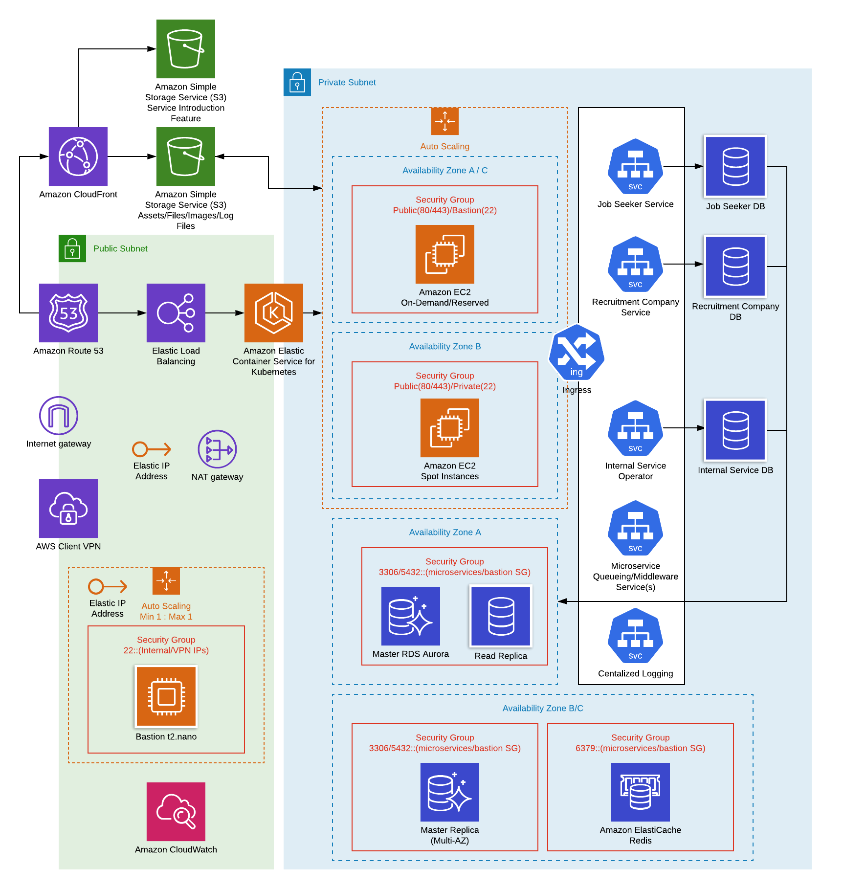
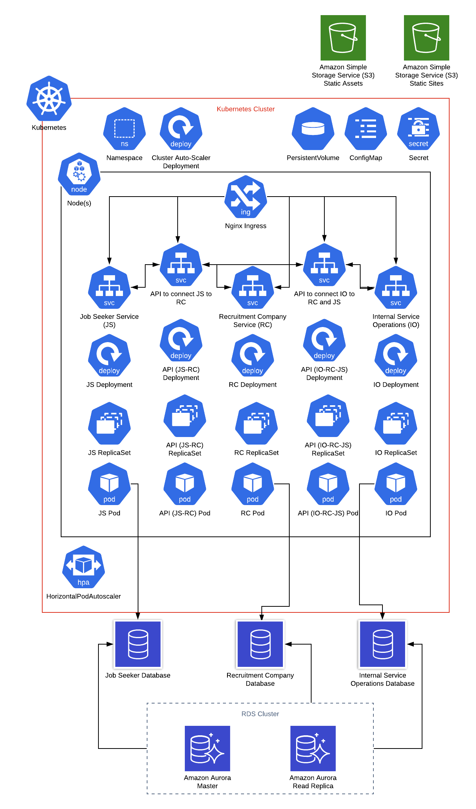

# Microservices Architecture

## Infrastructure Design

## Infrastructure Resources

### Network/Transport

* **VPC**
> Development, Stage, and Production Environments will be in different VPCs since they don't need access to each environment's resources and for security purposes. AWS Organizations can be created for both production and non-production environments for additional security upon access and to efficiently monitor billing of resources and cost optimization.

* **Public Subnet**
> Resources placed in public subnet will be limited for security purposes.
Bastion host(jump server), elastic load balancer, and nat gateway will be in public subnet.

* **Private Subnet**
> Development, Stage, and Production EC2 instances, elasticache, and RDS instances will be in the private subnet since these resources do not need direct access and will be accessible only from bastion host.

* **Nat Gateway**
> This resource allows services to have outbound internet access without having the security of these services compromised by disabling inbound internet access.

* **Cloudfront**
> This resource wll be used in front of assets and static site not just to encapsulate URLs but also for secure data transfer since cloudfront can enable SSL connection and supports the use of WAF(Web Application Firewall), Geo Restriction, and AWS Shield to block attacks from hackers such as DDOS. Also since cloudfront has edge location globally, better performance should be expected.
*Note*: Cloudfront can also be used in front of ELB/ALB too for performance and security purposes although cloudfront has a history of downtimes, this is still a debatable approach in terms of reliability.

* **Elastic Load Balancer**
> Services will be accessible for ports 443/80 behind load balancer since services will be in private subnet yet require public access. Also ELB is beneficial on preventing DDOS attack and auto scaling of instances. The load balancer will be cross-zonal for high availability.

### Application

* **EKS**
> Kubernetes is the latest go-to with microservices due to its container orchestration capability, scalability, ease with zero-downtime deployment, auto-healing capacity and cost efficiency. Kubernetes also has a lot a built-in resources which can be used for security, logging, and server/node assignment for containers. KOPS (Kubernetes Operations) can be used if the priority is to avoid vendor lock-in; however, EKS has fixed price with a managed control plane and the only things to worry about are the nodes (EC2 instances) and the containers; which narrows and simplifies deployments and operations management. For cost efficiency, a mix of spot and reserved instances with autoscaling should be used for production environment, then 100% spot instances is acceptable for development and staging environments to save around 70-90% cost. These instances will be located in private subnets with security groups allowing access to only EKS nodes, load balancer, and bastion host and spreaded out through 3 availability zones. 

* **EKS Services**
> Kubernetes will orchestrate four services for the microservices: 1) **Job Seeker Service**, 2) **Recruitment Company Service**, 3) **Internal Service Operator**, and 4) **Queueing/Middleware Service(s)** which will ensure loosely coupled communication between each services and each services' data (this can be apache kafka or rabbitMQ). The first three services will have one private database for each, which can be accessed by other services through middleware API(s), to avoid tight coupling and technical debts like difficulty on schema modification or worse change in one database table dependency for one service can negatively affect another. Another services to recommend would be EFK stack for centralized and secured logging. With this kubernetes logs and dashboards will be easier to search and manage although cloudwatch can also be used for backup. For sending e-mails Simple Email Service can be used but even SendGrid would do simply to avoid vendor lock-in.

* **ECR**
> This resource will be used for docker image storage for Kubernetes Clusters.

* **RDS**
> One Aurora RDS Cluster will be used with both Read Replica and Standby(Multi-AZ) containing three databases for each service. Data should be encrypted and storage autoscaling and performance insights should be enabled. The database is accessible only from kubernetes nodes(EC2 servers) and bastion host and the outbound access should be blocked. 

* **Elasticache(Redis)**
> This resource will be use to store cached objects such as assets for better performance and even session/authentication token. Redis should only be accessible through bastion host and kubernetes nodes(EC2 servers) and the outbound of redis should be blocked.

* **S3**
> This resource will be used for assets(javascript, css, file uploads). Also this will be used for static sites like the Introduction Features and it will be behind cloudfront for better performance and security. Server-side encryption(e.g. AES-256) will be enabled and load balancer, state files (e.g. Terraform state file) will be uploaded here.

* **Bastion Host**
> This will be used to access kubernetes nodes, redis, and database. The access to bastion host is limited to port 22 only and no outbound access is necessary. t2.nano is suitable for bastion server since ssh tunneling will not consume much resource

### Application Layer Architecture

 Based from the diagram above, there will be five main services:

<ol>
	<li>Job Seeker Service (JS) - mainly used by job seekers to search and apply (through messaging) for jobs</li>
	<li>Recruitment Company Service (RC) - mainly used by recruitment companies to post jobs and contact job seekers</li>
	<li>Internal Service Operations (IO) - mainly used by users (job seekers and recruitment companies) to contact system operators</li>
	<li>JS to RC API - used to connect Job Seeker Service to Recruitment Company Service</li>
	<li>IO to JS and RC API - used to connect Job Seeker Service and Recruitment Company Service to Internal Service Operations</li>
</ol>

The matching services JS, RC, and IO will have their own databases to avoid migration conflicts, design complexity, and other future technical debts especially regarding data integrity.

Each service will have its own deployment -> replicaset -> pod used for docker container deployment in which autoscaling is configured.
 

Secret files and variables like api keys can be added in Kubernetes secrets and/or even hashicorp vault; while configurations like php.ini will be placed in Kubernetes configmap to separate the application to configuration as per Twelve Factor App.

Each kubernetes node or AWS ec2 will be autoscaled using kubernetes cluster autoscaler.

Important logs inside the docker containers should be viewed from kubernetes logs via stdout and stderr configuration also as per Twelve Factor App.
